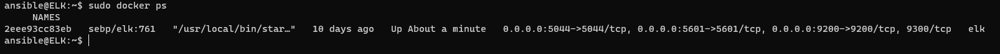

# Cybersecurity Bootcamp - ELK Stack Deployment

## Automated ELK Stack Deployment

The files in this repository were used to configure the network depicted below.

These files have been tested and used to generate a live ELK deployment on Azure. They can be used to either recreate the entire deployment pictured above. Alternatively, select portions of the playbook files located in the `roles` directory may be used to install only certain pieces of it, such as Filebeat.

  - [dvwa-playbook.yaml](Ansible/dvwa-playbook.yaml) - DVWA server build
  - [elk-playbook.yaml](Ansible/install-elk.yaml) - ELK server build
    - [filebeat-config.yml](Ansible/files/filebeat-config.yml) - Install and configure Filebeat
    - [metricbeat-config.yml](Ansible/files/metricbeat-config.yml) - Install and configure Metricbeat

This document contains the following details:
- Description of the Topology
- Access Policies
- ELK Configuration
  - Beats in Use
  - Machines Being Monitored
- How to Use the Ansible Build

### Description of the Topology

The main purpose of this network is to expose a load-balanced and monitored instance of DVWA, the D*mn Vulnerable Web Application.

Load balancing ensures that the application will be highly available, in addition to restricting access to the network.
- _TODO: What aspect of security do load balancers protect? What is the advantage of a jump box?_
    - `Load balancers defends an organization against distributed denial-of-service (DDoS) attacks. A jumpbox on the other hand allows admins to connect to a secure machine before launching and administrative task. Jump boxes are also used as an origination point  to connect to other servers or untrusted environments.`

Integrating an ELK server allows users to easily monitor the vulnerable VMs for changes to the logs and system traffic.
- _TODO: What does Filebeat watch for?_
    - `Filebeat monitors the log files or locations that you specify, collects log events, and forwards them to the ELK server`
- _TODO: What does Metricbeat record?_
    - `Metricbeat takes the metrics and statistics that it collects and shipes them to the ELK server`

The configuration details of each machine may be found below.
_Note: Use the [Markdown Table Generator](http://www.tablesgenerator.com/markdown_tables) to add/remove values from the table_.

| Name       | Function                         | IP Address | Operating System         |
|------------|----------------------------------|------------|--------------------------|
| Jump Box   | Gateway and Ansible Provisioner  | 10.0.0.4   | Linux (Ubuntu 18.04 LTS) |
| Web-1      | DVWA Web Server                  | 10.0.0.5   | Linux (Ubuntu 18.04 LTS) |
| Web-2      | DVWA Web Server                  | 10.0.0.6   | Linux (Ubuntu 18.04 LTS) |
| ELK Server | Aggregate Logs                   | 10.1.0.4   | Linux (Ubuntu 18.04 LTS) |

### Access Policies

The machines on the internal network are not exposed to the public Internet. 

Only the Jump Box and ELK virtual machines can accept connections from the Internet. Access to this machine is only allowed from the following IP addresses:
- _TODO: Add whitelisted IP addresses_
    - `Home Public IP Address`

Machines within the network can only be accessed by Ansible docker container in the Jump Box.
- _TODO: Which machine did you allow to access your ELK VM? What was its IP address?_
    - `The ELK VM can only be accessed via SSH from the Jump Box Ansible docker container and via HTTP through port 5601.`

A summary of the access policies in place can be found in the table below.

| Name       | Publicly Accessible   | Allow IP Addresses                     |
|------------|-----------------------|----------------------------------------|
| Jump Box   | Yes via SSH           | Home Public IP address                 |
| Web-1      | Yes via Load Balancer | JumpBox IP and Load Balancer Public IP |
| Web-2      | Yes via Load Balancer | JumpBox IP and Load Balancer Public IP |
| ELK Server | No                    | JumpBox IP                             |

### Elk Configuration

Ansible was used to automate configuration of the ELK machine. No configuration was performed manually, which is advantageous because...
- _TODO: What is the main advantage of automating configuration with Ansible?_
    - `The main advantage of Ansible is that it does not require an agent.`

The playbook implements the following tasks:
- _TODO: In 3-5 bullets, explain the steps of the ELK installation play. E.g., install Docker; download image; etc._
    - `Create new Virtual Network`
    - `Create new ELK VM`
    - `Download and configure the container`
    - `Launch and expose the container through published ports`
    - `Create firewall rules in NSG to allow traffic over port 5601`

The following screenshot displays the result of running `docker ps` after successfully configuring the ELK instance.

### Target Machines & Beats
This ELK server is configured to monitor the following machines:
- _TODO: List the IP addresses of the machines you are monitoring_
    - `Web-1 10.0.0.5`
    - `Web-2 10.0.0.6`

We have installed the following Beats on these machines:
- _TODO: Specify which Beats you successfully installed_
    - `Filebeat`
    - `Metricbeat`

These Beats allow us to collect the following information from each machine:
- _TODO: In 1-2 sentences, explain what kind of data each beat collects, and provide 1 example of what you expect to see. E.g., `Winlogbeat` collects Windows logs, which we use to track user logon events, etc._
    - `Filebeat monitors the log files or locations that you specify, collects log events, and forwards them to the ELK server. Metricbeat takes the metrics and statistics that it collects and shipes them to the ELK server`

### Using the Playbook
In order to use the playbook, you will need to have an Ansible control node already configured. Assuming you have such a control node provisioned: 

SSH into the control node and follow the steps below:
- Copy the Filebeat configuration file from your Ansible container to your WebVM's where you just installed Filebeat
- Update the hosts file to include the IP address of the target ELK server.
- Run the playbook, and navigate to http://[ELK-IP-Address]:5601 to check that the installation worked as expected.

_TODO: Answer the following questions to fill in the blanks:_
- _Which file is the playbook? Where do you copy it?_
    - [filebeat-playbook.yml](Ansible/roles/filebeat-playbook.yml)
    - [metricbeat-playbook.yml](Ansible/roles/metricbeat-playbook.yml)

- _Which file do you update to make Ansible run the playbook on a specific machine? How do I specify which machine to install the ELK server on versus which to install Filebeat on?_
    - `/etc/ansible/hosts` 
    - `Specify on the playbook which group of servers in the hosts file that the playbook will run on`
- _Which URL do you navigate to in order to check that the ELK server is running?
    - `http://[ELK-Public-IP-Address]:5601`

- _As a **Bonus**, provide the specific commands the user will need to run to download the playbook, update the files, etc._
     - `ssh -i ~/.ssh/id_rsa azdmin@[JumpBoxPublicIP]`
     - `sudo docker container ls -a`
     - `sudo docker start [container name]`
     - `sudo docker attach [container name]`
     - `cd /etc/ansible`
     - `ansible-playbook install-elk.yaml`
     - `cd /etc/ansible/roles`
     - `ansible-playbook filebeat-playbook.yml`
     - `ansible-playbook metricbeat-playbook.yml`